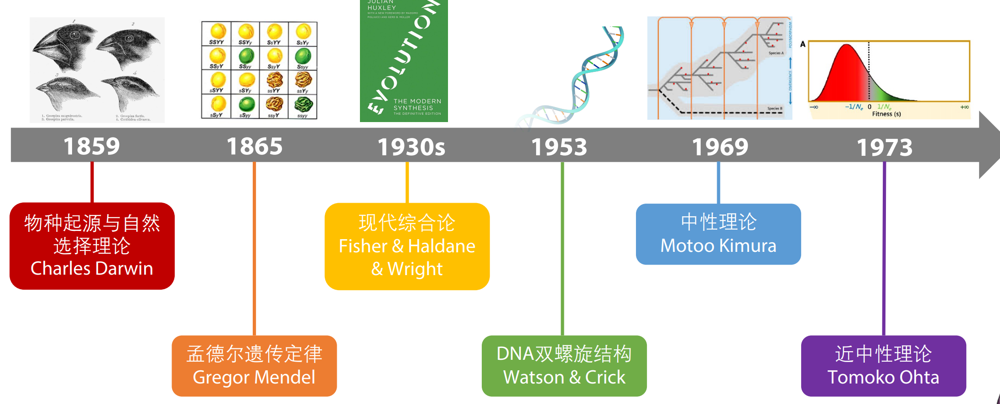

# 分子演化的基本概念

## 概论

分子演化是研究分子水平上的演化生物学过程的学科

分子演化的主要研究对象是DNA

研究内容包括：序列的演化速率，适应性或中性变异的积累，和基因组结构的变化等

分子演化的发展史：

从共同祖先到多样化的序列：

理论基础：同源性

物质基础：突变

驱动力：基因漂变&自然选择

## 突变

突变的分类：替换（转换1、颠换2）、插入、缺失、倒位、易位

突变速率：μ=mutation per site per generation

不同生命体中突变率差异很大，病毒显著高于其他生物

人类基因组突变率~1.8*10^-8，每代~50

突变率与基因组大小、身体大小、代谢率、基因组稳定性等有关

突变率的估计

直接估计方式：家系中亲自带基因测序

分子钟：根据一直的系统发生关系和分化时间和序列差异估计

## 同源性研究：序列比对

演化的理论基础：同源性

生物形态和功能上的相似，源自于它们具有一个共同的祖先

宏观的同源性由遗传信息的同源性决定

同源序列的寻找：序列比对

通过对齐使序列达到最大的相似度

全局比对：所有序列从头至尾，适用于序列长度相近、相似度较高的场景，常用于对已知的同源序列，通过比对判断位点间对位关系

局部比对：序列间部分区域进行比对，适用于相似度较低，序列长度可能相差较大，用于寻找序列中包含的同源片段

基于局部比对的BLAST

算法：动态规划，全局的Needleman-Wunsch和局部的Smith-Waterman

序列比对追求最高的序列间相似度，如何衡量？

一致性（完全一致的位点），常用于DNA，对应blast里面的penalty

相似性（性质相似的位点），常用于蛋白质，对应blast里面的打分矩阵（PAM, BLOSUM62, etc）

# 遗传距离的计算

## p distance

proportion of different sites

观察到的突变不等于历史上发生的突变

低估实际序列距离，仅在高度相似的序列间可以使用（p<0.05）

## 遗传距离计算的数学基础

如何通过观察到的替换次数推断历史替换次数？

概率模型及两个基本假设

位点独立，一个位点上发生替换的概率与其他位点无关

状态独立，一个位点下次替换成什么与上一次从什么状态替换无关（Markov）

马尔科夫过程

概率论中的概念，若⼀个随机过程的未来状态概率分布仅依赖于当前状态，⽽与过去状态⽆关，则这个过程具有⻢尔可夫性质，可称为⻢尔可夫过程

性质的核心：memorylessness

利用马尔科夫过程和状态转换矩阵，可以描述核苷酸的替换过程（碱基替换模型）

不同的模型对应不同生物学假设

## Jukes Cantor model JC69

1个参数：所有碱基替换概率相同

转移矩阵：

d=3\lambda t

## 不同模型的比较

越复杂的模型，参数量和自由度越高

复杂的模型更接近真实生物学过程吗？maybe

复杂的模型一定能获得更好的距离估计结果吗？

maybe，但会带来更大的方差和更不稳定的估计

对于相似性很⾼的序列（<5%或<10%），简单的模型就很有效，且估计的⽅差更⼩

对于中等⽔平差异度的序列（10-30%），模型的选择对于获得准确距离估计⼗分重要

对于差异很⼤的序列，模型选择和参数估计对结果影响巨⼤，最好能获得更多数据来减⼩差异度

因而不宜对差异过大的序列做距离估计

根据研究问题时间尺度的不同，选择合适类型的序列作为研究对象

种内或近源种：ncDNA

不同纲目之间：coding DNA

更高级的生命单元：rRNA等更保守的

DNA序列上的替换速率异质性

突变概率不同：基因组中不同位置、序列稳定性、GC含量等影响

突变被保存的概率不同：编码区、非编码区、codon位置等选择压不同

eg，人和恒河猴CytB基因的差异：对不同密码子位置分别估计可获得更准确的遗传距离估计

描述位点间替换速率的差异

假定微电商的替换速率服从一个分布

gamma分布最适合描述（Tamura & Nei, 1993, Mol. Biol. Evol.; Yang, 1994, J. Mol. Evol. ）

alpha≤1，少量位点为置换热点区，⼤部分位点置换率很低或接近不变

alpha>1，⼤部分位点置换率接近，很少的位点置换很快或很慢

alpha→∞，不存在位点间的异质性

实际应⽤中，考虑位点间替换速率符合伽⻢分布的模型写作+G或+gamma，例：JC+G，K80+G

伽⻢模型⼀般都更接近真实情况，估计更准确，但也需要更⼤数据量⽀持

另⼀种速率异质性模型：考虑⾮变异性位点

将位点分为可变和不可变两类

⼀般写作+I（invariable）

合适的替换模型是准确估计遗传距离，以及进⾏系统发⽣关系重建的关键！

“All models are wrong, but some are useful.”— George Box

选择标准：似然⽐检验 LRT，⾚池信息量准则 AIC，⻉叶斯信息量准则 BIC

常⽤⼯具：jModelTest

# 系统发生分析

evolution is tree-like

node, tip, branch

monophyly单系群, paraphyly并系群, polyphyly多系群  **必考！！！！**

形态相似不代表分类地位相似：食虫目的消失

形态差异大的分类也可能很相似：鲸偶蹄目的提出

分子数据的可靠性

基因树：某个/某些基因，分析手段

物种树：物种演化历史，终极目的

基因树可以在⼀定程度上反映物种树，但并不必然⼀致

系统发⽣学研究试图通过分析更丰富的数据、区分不同演化事件的影响，以
解析真实的物种演化历史

## 基因树和物种树为什么不一致？

基因交流gene flow

传统上的群体遗传学概念，指种群之间的个体迁⼊迁出带来的基因交换

基因水平转移horizontal gene transfer

⽣物体之间直接交换遗传物质，⽽⾮通过繁殖从亲本传给⼦代

主要发⽣于原核⽣物间，真核⽣物的线粒体、叶绿体被认为是来⾃⽔平基因转移（内共生）

不完全谱系分选incomplete lineage sorting

祖先群体中⻓期存在的多态性位点，在后续的分歧事件中，不同等位基因被随机的分到了不同的后代⽀系中

这种随机分配的结果，会导致部分位点的系统发⽣关系与⽀系的分歧关系不⼀致

多发生于物种发生很频繁的时候

影响很大的情况：适应性辐射Adaptive radiation：⼤量物种在短时间内快速分歧

## 系统发生树

### 树的分类

分⽀图 cladogram：仅有拓扑结构 topology

系统发育图 phylogram：拓扑结构和枝⻓ branch length

⽆根树 unrooted tree ：没有根节点位置

有根树 rooted tree：有根节点位置

### 树的分支结构

星状树 star tree：未解析拓扑结构 not resolved topology

⼆叉树 bifurcating tree：完全解析 fully resolved topology（终极目标）

多叉结构 polytomy：partially resolved topology

### 如何得到二叉树？

对于n个物种形成的⼆叉树：可能性太多，无法遍历

### 启发式搜索算法

等级聚类

凝聚法：物种凝聚成组

将序列逐一添加到树上，每一步都基于最优标准找到最好的树

**T= 3 + 5 + 7 + ⋯ + 2? − 5 = (n − 1)(n − 3)**

分划法：物种组合分裂

星状分解，从星形树开始基于最优标准逐一合并两类群

评价的树的总数：n（n^-1）/6-7

逐步添加法速度更快，但是不同阶段的树不能直接比较，因而这些树一般作为起始树

树重排/分支交换：打乱当前树

从一个起始二叉树开始，基于不同算法得到一组当前树的相邻数，再基于最优标准选出要移动到的邻居

最近邻互换法nearest neighbor interchange

子树修剪与重接法subtree pruning and regrafting

树对切与重连法tree bisection and reconnection

### 树的结构的定义

分割 bipartition/split 可以⽤来定义树的结构

树的拓扑距离 topological distance

分划距离 Partition distance (Robinson Foulds, 1981)：两棵树各⾃独有的bipartition数量之和

⼀致树consensus tree

衡量树之间的相似程度/共性：基于树之间共享的节点

严格⼀致树 strict consensus tree：仅包括所有树都⽀持的节点

多数⼀致树 majority-rule consensus tree：包括⼤于⼀定⽐例树⽀持的节点

# 系统发生树的构建方法

根据输入的特征类型分类————

## 基于距离的方法

输入的数据是距离矩阵

数据类型多样，速度快（距离已经算好了）

### UPGMA不加权算术平均对法

### 最小二乘法least square

### 最小进化法minimum evolution

### 邻接法neighbor joining

## 基于性状的方法

输入的是实际蛋白质/DNA序列

一般比较慢

### 最大简约法maxinmum parsimony

分支数

### 最大似然法maximum likelihood

似然值

### 贝叶斯法bayesian

根据拓扑结构分类：

聚类算法，根据特定算法对不同枝聚类，UPGMA, NJ

最优标准，根据特定标准判断拓扑结构的好坏

算数方法

UPGMA, NJ

速度快，有唯一的解

不对不同树进行比较，无法得知其他结构是否更好

最优方法

MP, ML, Bayesian, ME

可以对树的好坏作比较，在大量树结构中找最好的

速度慢，且难以穷尽所有可能的拓扑结构
